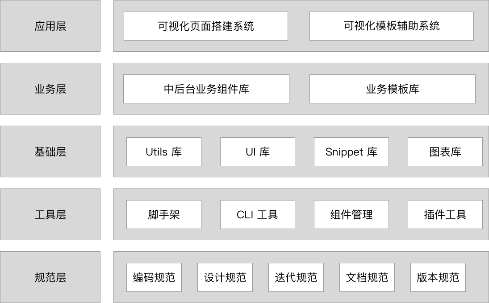

# 简历

| 姓名   | 年龄 | 出生年月   | Email                | GitHub                               | 博客                                       | 掘金                                                    |
| ------ | ---- | ---------- | -------------------- | ------------------------------------ | ------------------------------------------ | ------------------------------------------------------- |
| 吴佰清 | 29   | 1991-06-14 | wubaiqing@vip.qq.com | [查看](https://github.com/wubaiqing) | [查看](https://www.cnblogs.com/wubaiqing/) | [查看](https://juejin.im/user/5a0d37bc6fb9a0451a75ef5a) |

期望应聘的岗位：研发经理/前端技术专家/前端架构师。

## 简介

目前工作 11 年，现团队中工作 `9` 年，2015 年在 200 人的研发团队晋升到研发经理（P7），禧云信息的前端负责人。一线带队经验 5 年，期间培养了**三名 P5 级工程师**，**五名 P6 级工程师**。

擅长的领域是**前端基础建设**，创造了**以注解的方式声明路由**，并把思路提供给开源社区（Umi）。

对**业务中台建设**（对标蚂蚁金服）有着非常丰富的作战经验。

擅长从产品、研发、运营角度考虑问题和解决问题。深度参与业务，能独立完成人员招聘、团队建设、产品研发、项目管理等工作。

2018-至今 维护开源项目前端**每日时报** GitHub 1.5K Star（更新 347 天）；  
2013 博客园-推荐博客（排名 116）。

## 工作技能

有良好的沟通能力和团队合作意识，善于寻求资源解决问题。
（标题右侧）

### 前端领域

开源项目贡献过 `Umi`、`Umi-Next`、`QianKun`、`Ant-Design-Vue`、`Element-UI`、`Vue-Next`、`React-DND`、`React-ID-Swiper`、`Count-Up` 等；

熟练掌握 Vue、React 技术体系。擅长**前端工程化/自动化**，如：数据大屏、运营活动生成器、业务组件平台、区块平台、开发提效工具（气泡）、UI 工具（Low Code）、前端规范、工程测试、VSCode 辅助插件、脚手架等。

熟悉 Lerna 多包管理以及 NPM 发包流程，在 NPM 官方发布近 **30 多个包**。

熟悉**微前端**技术，如 Webpack5-Module-Federation、QianKun、Single-SPA，2019 年已**正式商用**。

从 2018 年推广 Yarn 以及之后的 Yarn PNP 在到内存扩充为虚拟硬盘（RAM-Disk），让前端项目构建时间提升了 **6 倍以上**。

对持续集成有非常丰富的实操经验，熟练的使用 Azure Pipelines、Travis、Circle 等平台。

### 服务端领域

开源项目贡献过 Laravel5.4、Yii2、Yii1-Gii、Ruby-China，**可以把服务端思想带入前端**。

熟悉编译性语言和脚本语言，如 [PHP 7.1](https://github.com/wubaiqing/meipin)、NodeJS、[Java](https://github.com/wubaiqing/java)、[Ruby On Rails](https://github.com/wubaiqing/mayitemai)、Python2、[Objective-C](https://github.com/wubaiqing/privilege/tree/master/privilege)、[Spring Boot](https://github.com/wubaiqing/java/tree/master/source/spring-boot)、[Spring Cloud](https://github.com/wubaiqing/java/tree/master/source/spring-cloud)，**2015 年是 PHP-高级工程师晋升为研发经理**。

### 产品领域

**技术商业化非常敏锐**，在没有产品经理帮助的情况下，可以**从零开始构建一个技术平台**。

善于先有场景，再有故事，通过故事拆解出信息架构，菜单结构和功能点，最后归入某个版本。

了解《上市审计》、《加计扣除》、《专利申请》、《著作权申请》相关的流程。

### 工具领域

开源项目贡献过 iTerm2 Extend（Search Plugin）。

14 年接触 Docker，同年发布应用到 [Docker Hub](https://github.com/wubaiqing/docker-shadowsocks-python)。

了解 Vagrant、Docker Compose、Kubernetes、ServerLess 等技术。

有 9 年的 macOS、Vim、Git、Git-Flow 使用[经验](https://www.cnblogs.com/wubaiqing/archive/2011/12/18/2271724.html)，擅长用命令行而不是图形界面。

## 特别之处

在关键岗位必有**备份**，善于从企业角度考虑**可替代成本**和**流动成本**。能站在未来看今天，帮助业务和团队活好未来，善于挖掘**不希望**拥抱问题，落实为团队共识。

具备良好的[写作和排版功底](https://xiyun-international.github.io/java-unit-docs/04-complex/01-optimize)，有项目周报、RFCS、技术白皮书、项目交接、RCA 文档的写作习惯；

善于被动学习和共享自己掌握的技术，熟练的掌握 [Keynote](http://note.youdao.com/noteshare?id=33985951c21d2d2898c8190412dc1219)，有面对 40 人以上跟 CEO、CTO、运营副总裁汇报的演讲经验。

责任心强、严谨、认真、仔细；

每一个工作过的团队，包括公司上下对我的技术认可度和职业道德的评价都很高。

## 工作经验

**9 年期间一直在一个研发团队工作**。

（文字可以是红色，在标题右侧）

### 2017 年 7 月至今 禧云信息技术有限公司 （研发经理）

互联网+ERP 运营商。

**公司简介：**

中国团餐领导者，获蚂蚁金服、鼎辉等投资，2 年多的时间服务 6000 多个餐饮中心，8 万多档口门店。日均线上交易 800 万笔，日均触达 2000 万人次。

**职责：**

1. 组建前端团队，负责人员招聘和人才培养，管理 9 人。
2. 负责前端基础建设如，规范制度、文档服务、基础框架、物料库、UI 库，前后端协同的工具的开发和指导。
3. 负责前端领域新技术调研以及商用上的落地。
4. 组织分享，共计 91 次演讲式分享 8 次项目及演讲，34 次邮件式分享。

**前端基础架构：**

**团队技术栈：**

PC 端：Vue+Vue-Router+Vuex+Vue-CLI+自研 CLI 路由插件+Lodash+Normalize+core-js+Element-UI/Ant-Design-Vue+Prettier+ESLint+Airbnb+CommitLint+Less+LintStaged+Mock

**主要系统：**

**2019 年 7 月 禧鹊，** ERP 系统，主要负责商机、项目、设备的创建和审批的流程控制；  
**2019 年 3 月 前端生态，** 前端的提效工具含 UI、CLI、监控、脚手架、VSCode 插件、区块平台、注解路由、微前端等；  
**2019 年 3 月 鹊台，** 设备的资产管理平台，负责设备的库存、发货、追溯、调拨等，管理了 7W 多台设备，帮助公司减少设备丢失的损失；  
**2018 年 8 月 渠道商，** 对外的 ERP 系统，属于共创平台，让二三线具备谈判学校资格的渠道商入驻，从而赚取佣金返佣；  
**2018 年 3 月 运营支撑平台，** 针对于商家活动的一个管理平台，如是否开通刷脸付、支付通道、支付渠道的切换、打造一体话的管理平台；  
**2017 年 10 月 商家中心，** 是给商家使用的管理平台，可以实时看到食堂的销售金额，对商家门店和支付配置做统一的管理；  
**2017 年 7 月 太空桥，** 硬件设备远程管控平台，通过这个平台，控制远端的设备，比如远程设备的桌面、应用远程安装、监控和策略的管理。

### 2015 年 9 月至 2017 年 7 月 北京云纵信息技术有限公司

#### 研发经理

互联网+ERP 运营商。

**公司简介：**  
聚焦高频消费场景如，社餐、快消、团餐、停车等行业，目前覆盖 5 万家门店，1500 所学校，3000 个停车场，DAU 达 1000 万。

**职责：**

1. 组建项目团队，最多管理 13 名全栈工程师，含一名服务端 P7 工程师。
2. 规划自研类产品，在不依赖产品经理的情况下，输出产品和技术的方案，调研业界竞品。
3. 负责移动端 H5 试点。
4. 组织分享，共计 53 次邮件式分享，1 次演讲式分享，1 次 COO 的演示汇报。

**主要系统：**  

**2017 年 2 月 数据大屏，** 通过图形化界面快速搭建可视化监控大屏，提供丰富的可视化数据组件，满足业务监控、会议展览、投资咨询等多种业务的展示需求，尤其满足 PC 浏览器或者手机浏览器访问下的自适应布局；  
**2016 年 10 月 魔镜，** 竞品分析平台，竞对的各个城市的各种经营数据，如：门店的地址、电话、用户活跃度做对比和分析，从而影响商业策略；  
**2015 年 9 月 云雀移动，** 这个时期手机客户端刚开始流行，使用 AngularJS + CoffeeScript 等技术打造了一个 H5 的移动端 ERP 系统，方便销售谈业务、拜访商户做实时的项目跟踪。

### 2011 年 3 月至 2015 年 9 月 众美窝窝（中国）有限公司 (NASDAQ ：JMU)

#### PHP-高级工程师

本地生活服务电子商城。

项目主要介绍：
**2013 年 2 月至 2015 年 8 月 电影频道，** 主要围绕着在线选座，影片数据的同步；  
**2011 年 3 月 窝窝团，** CMS 管理后台，负责核心的商品管理、商品标签等核心业务。

职责：2013 年 7 月晋升 PHP-高级工程师，担任小组组长带领两位 PHP 同事一起开发。

### 2010 年 3 月 2011 年 3 月 北京一家网有限公司

#### PHP-工程师

团购导航

职责：基于百度地图开发附近团购，CMS 日常维护、配合 SEO 进行搜索引擎优化。

### 2009 年 8 月 2010 年 2 月 北京辛巴荣耀网络科技有限公司

#### PHP-工程师助力

企业建站

职责：使用 Discuz UCenter、ECShop、PHPCMS、DEDECMS 做企业产品的二次开发。

## 教育背景

中央广播电视大学 计算机信息管理 专科
